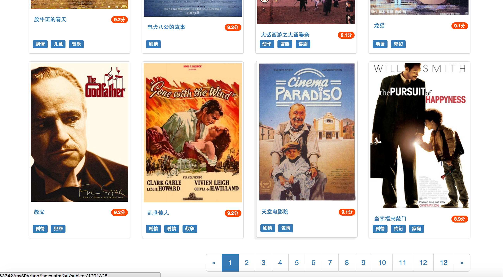
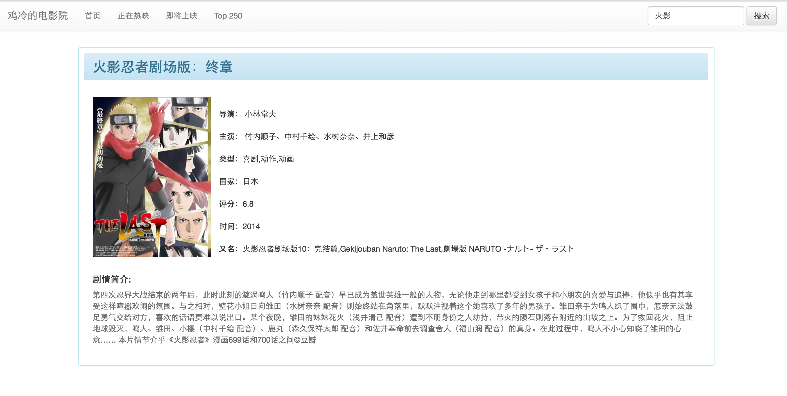

## `VUE`单页应用（电影查询）

###框架：Vue + VueRouter + VueResource + ES6 + Webpack + bootstrap

###实现的功能：

+ 在首页、正在热映、即将上映、Top250之间实现前端路由跳转
+ 通过VueResource异步请求豆瓣的jsonp数据，通过template.vue组件渲染(组件也是异步加载的)
+ 点击电影通过details.vue组件渲染电影详情页
+ 点击分类标签异步请求拥有相同标签的电影
+ 通过搜索栏搜索电影
+ 根据后台返回的数据(total:表示电影总数)动态生成分页标签
+ 通过分页标签异步请求分页数据

###遇到的困难：

+ 对webpack的搭建不熟悉，导致在生成打包时异步请求模块出错，排查错误原因浪费了较多的时间
+ 对Vue-Router路由转化各阶段的钩子函数不熟悉，导致在切换路由请求后台数据时需要一个个手动尝试各个钩子函数
+ 对组件的解耦做得还不够，要多加练习

###收获

+ 对Vue-Resource更加熟悉了，特别是对于动态组件(动态路径)加载有了更深刻的认识
+ 充分意识到了模块化开发和组件化开发的优势，就这个单页应用而言，如果需要添加一些后续的栏目只需要增加一条路由和一个导航块即可
+ 用上了ES6中的Promise还有字符串、数组和对象的一些扩展，虽然还有很多新特性还没用上，但是已经体验到使用ES6开发那种快感了

##最后上图

